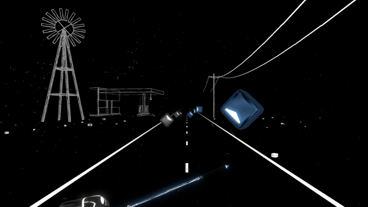
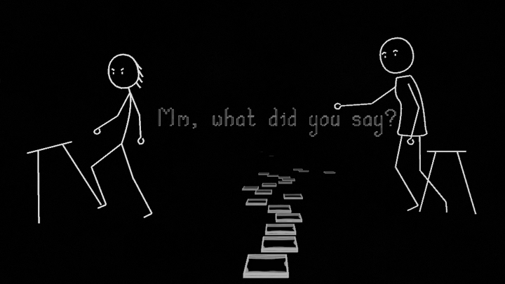
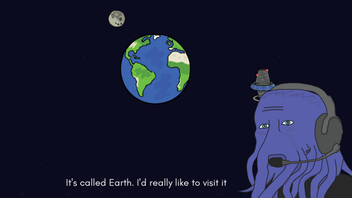

I think of myself as a creative developer. I like to give life to new stories and experiences and support this work with innovative and challenging code.

My professional work focuses on parallel computing and Machine Learning. I am lucky to work on state-of-the-art projects at NVIDIA, such as RAPIDS and Merlin.

| | |
|:---:|:---:|
| | |
| | |